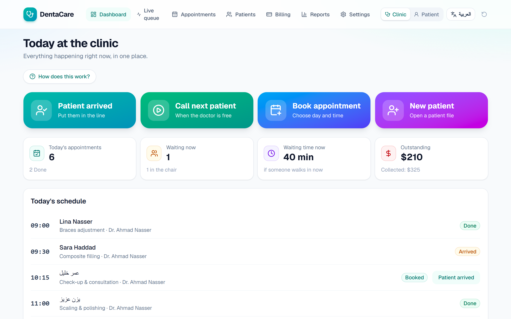
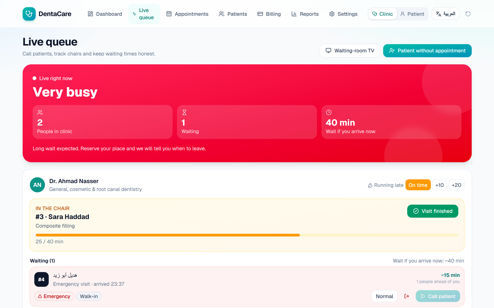
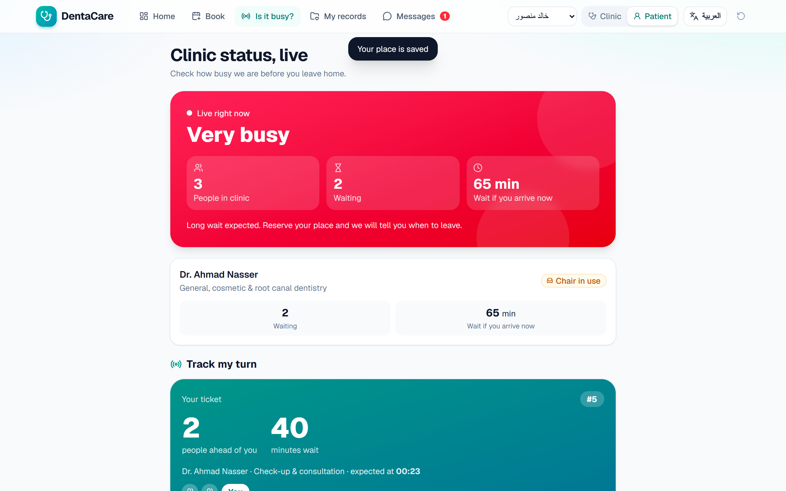
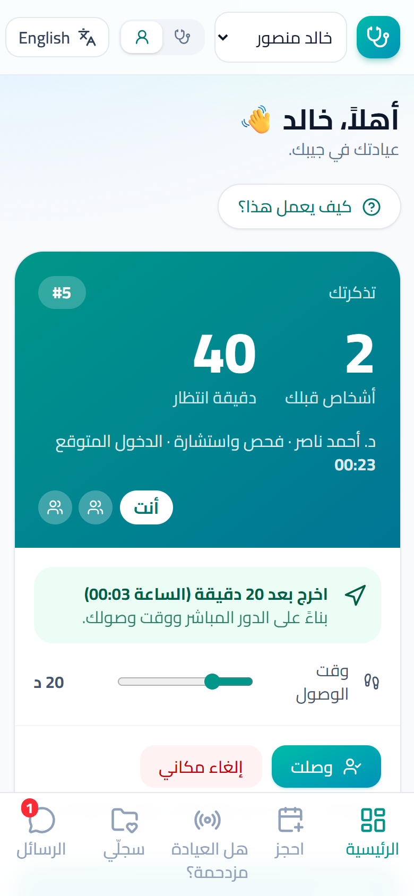
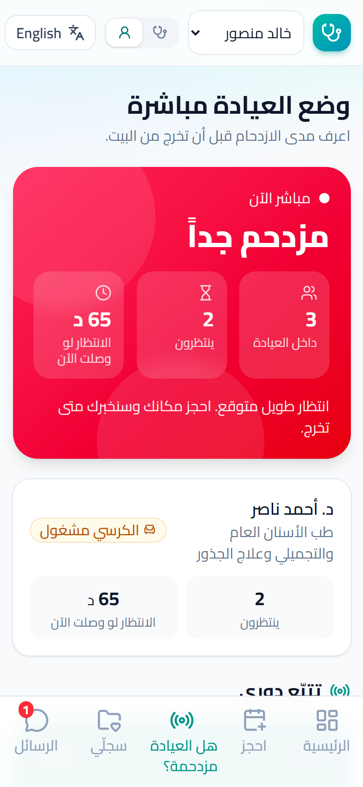
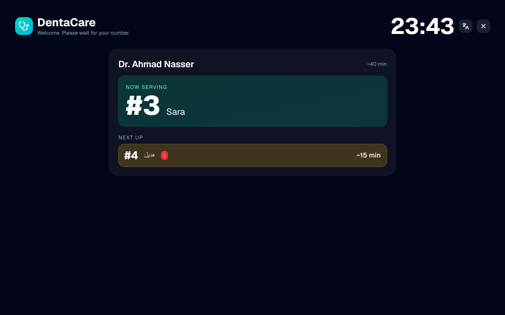
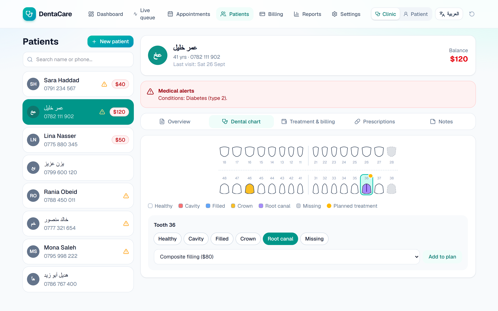
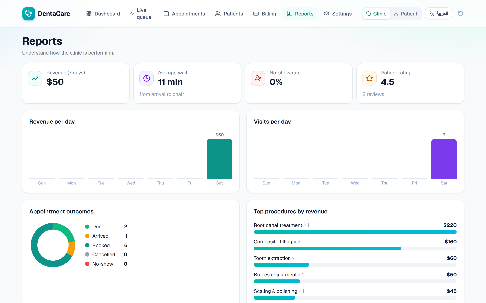
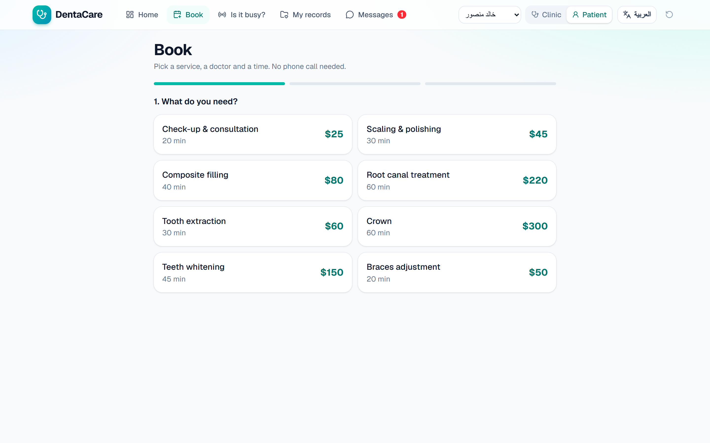

<div align="center">

# 🦷 DentaCare

### Nobody should have to sit in a waiting room wondering "how long will this take?"

A complete dental clinic system with a **live waiting queue**, online booking, an interactive tooth chart, billing and reports. Works in **English and Arabic (full RTL)** on phones and laptops.




</div>

---

## 💡 The problem

You arrive for a 10:00 appointment. The doctor is running late, three people are ahead of you, and nobody can tell you how long it will take. You sit for an hour. Meanwhile the receptionist answers the same question all day: *"how many people are before me?"*

## ✅ How DentaCare solves it

| For the patient | For the clinic |
|---|---|
| See **how busy the clinic is right now** before leaving home | One screen shows who is in the chair and who is next |
| **Reserve your place from home** and get told exactly when to leave | Wait times are calculated for you from each treatment's length |
| Get a message when you are **next**, or when the doctor is **running late** | One tap: "Doctor is 10 / 20 min late" informs everyone waiting |
| Book, cancel and see your file from your phone | Cancelled slot? The **waiting list** notifies the next patient automatically |

### The live queue



The estimate is not a guess. It adds the time left for the patient in the chair, the duration of every treatment ahead, a short cleaning buffer, emergencies jumping the line, and the doctor's announced delay.

### What the patient sees

<p align="center">
  
</p>

- **"Is it busy?"** is a public page. Share its link on Google Maps, WhatsApp or a QR code on the door.
- **"Reserve my place"** saves a spot in the line. The app shows people ahead, expected time, and **"Leave in 20 min"** based on the patient's own travel time.

<p align="center">
  
  &nbsp;&nbsp;
  
</p>

*Arabic, right-to-left, on a phone. One tap switches the whole app between English and Arabic.*

### A TV for the waiting room



Open `/display` on any screen: **Now serving** and **Next up**, with first names only for privacy.

---

## 🧰 Everything a clinic needs

**Reception and the doctor**

- **Big-button dashboard**: *Patient arrived*, *Call next patient*, *Book appointment*, *New patient*. Made so a first-time user can work without training.
- **Calendar** with double-booking protection, lunch break, closed Fridays and a smart waiting list.
- **Patient file** with medical alerts (allergies, conditions), notes, visit history and recall reminders.
- **Interactive dental chart** (32 teeth, FDI numbering) with conditions and planned work:



- **Treatment plans** with estimates, **prescriptions** and **printable receipts**.
- **Billing**: finishing a visit creates the invoice automatically; record full or partial payments.
- **Reports**: revenue, visits, no-show rate, average wait, patient ratings and top procedures.



**For the patient**

- Booking in a few taps, choosing a service, then a day and an available time:



- Messages inbox: booking confirmations, reminders, "you're next", delays.
- Their own file: tooth chart, treatments, balance, prescriptions, doctor's notes.
- Rate the visit after it ends.

---

## 🌍 Built to be easy for everyone

- **Arabic and English**, with proper right-to-left layout and an Arabic-first font.
- **Responsive**: bottom navigation on phones, top navigation on large screens.
- **Plain language**: no technical words, large type and big buttons, and a short *"How does this work?"* guide of three steps that can be hidden once learned.

## 🔎 Try the "live" effect

1. Open the app in **two browser tabs**.
2. Tab 1: switch to **Clinic → Live queue**. Tab 2: switch to **Patient → Is it busy?**
3. In tab 1 press **Call next patient**, or **+20** for "doctor is late". Tab 2 updates immediately, and the patient gets a message.

Switch roles with the **Clinic / Patient** toggle at the top. **Reset demo data** restores the starting state (the demo data is generated relative to the current time, so the queue always looks alive).

---

## 🛠️ Tech and decisions

| | |
|---|---|
| Framework | Next.js (App Router), TypeScript |
| Styling | Tailwind CSS, lucide-react icons |
| State | React context persisted in `localStorage`, synced across tabs with the `storage` event |
| i18n | Small typed dictionary (`src/lib/dict.ts`), `dir` and `lang` switch at runtime |
| Queue engine | `src/lib/queue.ts`: pure functions computing position and wait per ticket |
| Slots | `src/lib/slots.ts`: availability from working hours, lunch, durations and existing bookings |
| Output | Fully static export, so it can be hosted anywhere |

```
src/
├─ app/            clinic pages: dashboard, queue, appointments, patients, billing, reports, settings
│  ├─ p/           patient pages: home, book, records, inbox
│  ├─ live/        public "how busy is the clinic?" page
│  └─ display/     waiting-room TV
├─ components/     Odontogram, live widgets, receipt, UI kit
└─ lib/            store, queue engine, slots, i18n dictionary, seed data
```

## ▶️ Run it

```bash
npm install
npm run dev        # http://localhost:3000
```

Static export (for any hosting):

```bash
npm run build      # outputs ./out
# serving from a sub-folder:  NEXT_PUBLIC_BASE_PATH=/dental-clinic npm run build
```

## 🚧 Honest limitations and next steps

This is a front-end product demo, so a few things are simulated on purpose:

- **Data lives in the browser**, so the live sync works between tabs of one browser, not across devices. Real cross-device updates need a backend: PostgreSQL + Prisma, and WebSockets or Server-Sent Events for the queue.
- **No real login**: the Clinic / Patient toggle stands in for authentication and roles.
- **Messages and payments are simulated**: next step is WhatsApp Cloud API or Twilio for messages, and Stripe for payments.
- **Next**: automated tests (Playwright), multi-doctor and multi-branch scheduling (the data model already supports more than one doctor), and image upload for X-rays.
